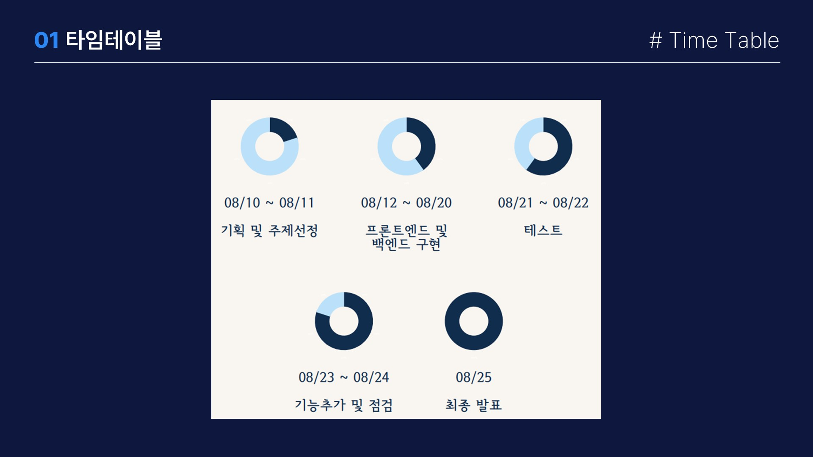
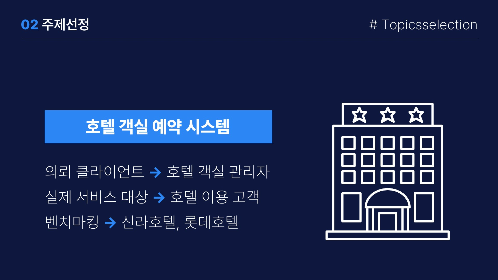
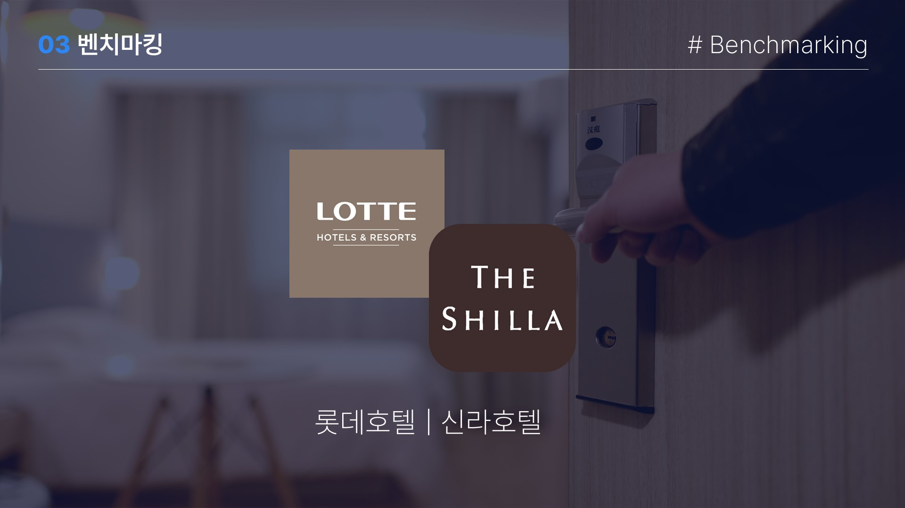
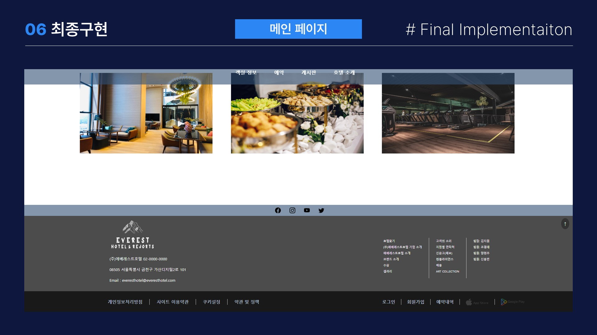
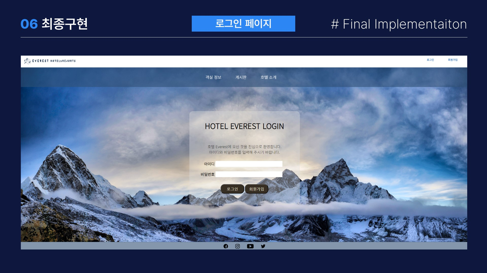
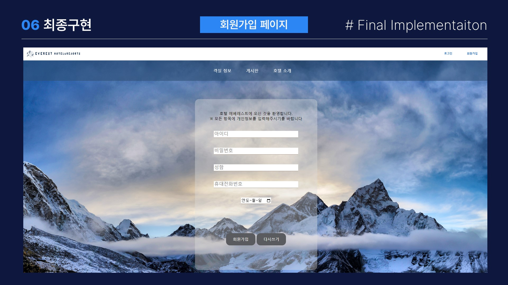

# 🏨 호텔 에베레스트 (SpringBoot)
> **Spring Boot 기반의 직관적인 호텔 예약 및 정보 서비스**
> 프로젝트 기간: 2023.08.10 ~ 2023.08.25 (팀 프로젝트)

## 🛠️ 사용 기술 및 라이브러리
- GitHub, JSP, Java, Oracle DB, Spring Boot

---

## 📱 담당한 기능
- 프로젝트 팀장(총괄 진행), 기획, DB설계
- 백엔드 전체 세팅, 게시판
- 게시판 UI
- 호텔 소개 UI, 카카오맵 API 사용

---

## 🖼 프로젝트 스크린샷 (토글을 클릭하여 확인)

📸 전체 시스템 프리뷰 (클릭)

---

## 💡 깨달은 점
- **Spring Boot**에 대한 이해도 상승
- **MVC** 패턴 경험
- **JAVA** 활용 능력 향상
- **JSP** 활용 능력 향상
- 프로젝트 기획의 중요성
- 기획의 중요성 느낀 이유: 기획 되지 않은 부분이 있으면 팀원들이 이리저리 튈 수 있다. 사전에 맞추지 않은 부분에 있어 서로 소통하고 이야기하면 좋겠지만 먼저 물어보기 어려워하는 팀원도 존재한다. 조금 더 먼저 신경 쓰고, 기획을 탄탄하게 해야 한다고 느꼈다.
